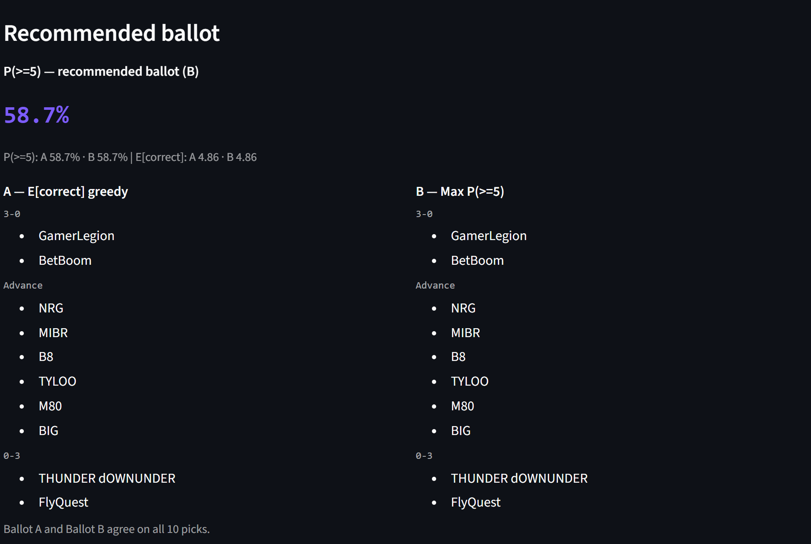
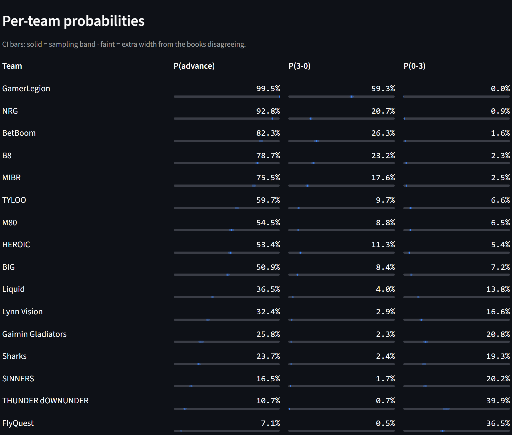

# swiss-mc — IEM Cologne 2026 Swiss Monte Carlo & Pick'Em Optimizer

Monte-Carlo simulates the IEM Cologne Major 2026 CS2 Swiss stage and gives you honest per-team
odds, market-anchored ratings, and the math-optimal Pick'Em ballot. The point isn't a pretty
dashboard, it's a **correct** one: every probability is validated against the Valve rulebook and
a real past-Major backtest, and the uncertainty is shown, not hidden.

No scraping. APIs only. Single local user. Python + numpy + Streamlit.




## Quickstart

```bash
uv run streamlit run app.py
```

`uv` auto-creates the env and installs everything from `pyproject.toml` (~45s cold), same command
on Windows, Mac, and Linux. No `uv`? `pip install streamlit numpy && streamlit run app.py`.

**The first sim needs no API key and no editing.** Click **Run ▶** with the shipped defaults and
watch ~100k Swiss tournaments resolve in ~15 seconds (rating-only). Add odds (below) to make it
market-driven.

## What the numbers mean

- **P(3-0) / P(advance) / P(0-3)** — each team's chance of going 3-0, of qualifying (3 wins
  before 3 losses), and of crashing out 0-3. The per-team "P(advance)" column is the genuine
  "does this team make it through" stat.
- **Two-tone CI bars** — under each number. The **solid** inner band is sampling noise (Wilson
  interval); the **faint** outer band is *extra* width from the odds sources disagreeing
  (epistemic uncertainty). A wide faint band means the books don't agree yet. It is honest
  uncertainty, not false precision.
- **The Pick'Em coin (2/6/2)** — you pick 2 teams to go 3-0, 6 to advance, 2 to go 0-3; **≥5 of
  10 correct** upgrades the coin, so the headline number is **P(≥5/10)**, the true coin odds.
  - Subtle but load-bearing: an **advance** pick scores only on an exact **3-1 or 3-2** finish.
    A 3-0 satisfies the 3-0 bucket, never the advance bucket. Getting this wrong inflates the
    coin odds by ~30 points (it's why a naive model reads ~90% when the honest number is ~59%).
- **Two ballots** — **A** maximizes E[correct] (greedy); **B** maximizes P(≥5) (a hill-climb that
  re-buckets to dodge correlated picks, e.g. two 0-3 picks that meet in Round 1 and can't both
  hit). On a clear field they agree; they diverge when there's correlation to exploit.

## How it works

```
seeds + ratings ──► Swiss engine ──► Monte Carlo ──► optimizer ──► ballot + P(≥5)
   (data/            (pairing,        (N sims,         (2/6/2,
    stage1.json)      Buchholz,        Wilson CI,       3-1/3-2 scoring,
                      rematch table)   epistemic loop)  P(≥5) hill-climb)
        ▲
        │  back-solved from market odds
        │
   odds ensemble ◄── OddsPapi (Pinnacle, de-vigged) + Kalshi (KXCS2GAME)
   (log-opinion pool, per-source variance → the faint band)
```

- **Engine:** round-by-round Swiss pairing with Buchholz difficulty (`Σ opp.wins − opp.losses`),
  the Valve 15-row rematch-avoidance table, and Bo3 as a closed-form `p²(3−2p)` draw.
- **Odds ensemble:** OddsPapi gives Pinnacle (the sharp book) de-vigged two-way; Kalshi gives a
  keyless prediction-market price. Both are pooled with a weighted **log-opinion pool**; their
  disagreement becomes the epistemic variance that widens the faint CI band. Market series
  probabilities are **back-solved into per-team ratings** so the whole bracket is market-anchored.
- **APIs only, fail-soft:** missing key → it degrades (OddsPapi needs a key; Kalshi is keyless)
  down to rating-only with an honest banner, never a crash. Keys live in a gitignored `.env`,
  never in the app process, and are never logged.
- **Full Major (v3):** the stage selector runs Stages 1–3 through the same validated engine —
  Stage 3 is all-Bo3 — and a fully-locked, complete stage auto-derives the next stage's seeds
  (invited 1-8 by VRS, advancers 9-16 by final Buchholz) as an editable [INFERRED] overlay.
  Odds/results caches are stage-stamped, and the app refuses a cache fetched for another stage
  (the same engine id names a different team on each stage).

## Correctness is the product

- **Backtest gate:** the engine reproduces StarLadder Budapest 2025 Stage 1's actual R1–R5
  pairings exactly (`tests/test_backtest_budapest_2025.py`). If that ever goes red, the pairing
  logic is broken. Seeds for the backtest come from the authoritative Valve VRS snapshot.
- **190+ passing tests**, including regression guards that *distinguish the right rule from the
  wrong one* (a test that still passes when you revert the fix is theater, not a guard).
- **Cologne seeds confirmed:** the seed order is verified against Liquipedia + the live Kalshi
  bracket + the R1 pairing rule, so the trust badge reads *validated*, not *inferred*.

Two real probability bugs were caught and fixed during the live-odds work (a 12× normalization
inflation and the advance-pick scoring rule above). The full story is in
**[docs/LESSONS.md](docs/LESSONS.md)** — worth reading if you care about how subtle simulation
math goes wrong.

## Predictions — call-my-shot (Stage 1, market-anchored)

Snapshot from live OddsPapi (Pinnacle) + Kalshi, back-solved and simulated. R1 is market-anchored;
later rounds are modeled from the back-solved ratings. These are a model's odds, not a guarantee.

| Team | P(advance) | P(3-0) | P(0-3) |
|---|---:|---:|---:|
| GamerLegion | 99.4% | 59.1% | 0.1% |
| NRG | 92.8% | 20.8% | 0.9% |
| BetBoom | 82.8% | 26.7% | 1.5% |
| B8 | 78.3% | 22.9% | 2.3% |
| MIBR | 75.5% | 17.4% | 2.5% |
| TYLOO | 60.2% | 9.9% | 6.4% |
| M80 | 54.1% | 8.8% | 6.6% |
| HEROIC | 53.4% | 11.4% | 5.6% |
| BIG | 51.0% | 8.4% | 7.0% |
| Liquid | 36.6% | 4.0% | 13.9% |
| Lynn Vision | 32.5% | 3.0% | 16.4% |
| Gaimin Gladiators | 25.0% | 2.3% | 21.5% |
| Sharks | 23.6% | 2.4% | 19.3% |
| SINNERS | 16.7% | 1.7% | 19.9% |
| THUNDER dOWNUNDER | 10.9% | 0.7% | 39.7% |
| FlyQuest | 7.1% | 0.5% | 36.5% |

**Recommended ballot** (E[correct] and P(≥5) agree here):
- **3-0:** GamerLegion, BetBoom
- **Advance:** NRG, MIBR, B8, TYLOO, M80, BIG
- **0-3:** THUNDER dOWNUNDER, FlyQuest
- **True coin odds: P(≥5/10) ≈ 59%**

## Live odds setup (optional)

```bash
cp .env.example .env        # then add ODDSPAPI_KEY (Kalshi needs no key)
```

In the app, click **Fetch odds now**. It pulls OddsPapi + Kalshi, writes a read-only
`data/odds_cache.json`, and the next Run is market-driven (two-tone bands light up). Missing key →
rating-only, no crash. Note: odds-fed runs do K=12 epistemic draws, so they take ~12× longer than
rating-only at the same N.

## Honest caveats

- It's a **model, not an oracle.** R1 is anchored to live market prices; rounds 2–5 are projected
  from back-solved ratings, so deeper-round numbers are softer than R1.
- Practical N is ~100k–200k: the engine retains the full per-sim sample for the optimizer, so
  memory grows with K·N (a 1M odds-fed run needs ~11 GB). Probabilities are converged well before
  that, so this is a non-issue in practice, just don't crank N to 1M.
- The **playoff** Pick'Em (a 7-pick round-weighted ballot) is not built — only the Swiss 2/6/2
  optimizer is. See `TODOS.md`.

## Project layout

```
app.py              Streamlit UI (controls, run, two-tone bars, ballot, live mode)
engine/             pure compute core (no streamlit/httpx)
  swiss.py            round-by-round pairing + Buchholz + rematch table
  montecarlo.py       MC runner, Wilson CI, epistemic outer loop
  probs.py            Bo3 closed-form, epistemic Beta draws, variance clamp
  optimizer.py        2/6/2 ballot, 3-1/3-2 scoring, P(≥5) hill-climb
  backsolve.py        market series probs → per-team ratings
  live.py             conditional re-sim + pick status (live/dead/secured)
odds/               OddsPapi + Kalshi parsers, de-vig, log-opinion pool (pure numpy)
scripts/            fetch_odds + fetch_results — the ONLY provider contact; both take --stage
                    and stamp _meta.stage so a cache can never feed the wrong stage's run
tests/              190+ tests incl. the Budapest backtest gate + real-data seeding gates
docs/LESSONS.md     what we learned and would do differently
ROADMAP.md          shipped vs next   ·   STATUS.md  current state
```

## Stack

Python ≥3.12 · numpy 2.4 · Streamlit 1.57 · httpx (odds only) · python-dotenv · `uv`. No pandas,
no scipy. Planned and built with a phased, test-gated workflow (see `ROADMAP.md` / `STATUS.md`).

## Event-day cold-start drill (30 seconds)

1. `git pull` — latest engine + rating tweaks.
2. **Fetch odds now** (if markets are posted) to price the sim from live markets.
3. Confirm the seeds against the reconcile table; flip **"seeds confirmed."**
4. Click **Run ▶**. First sim needs no API key.
